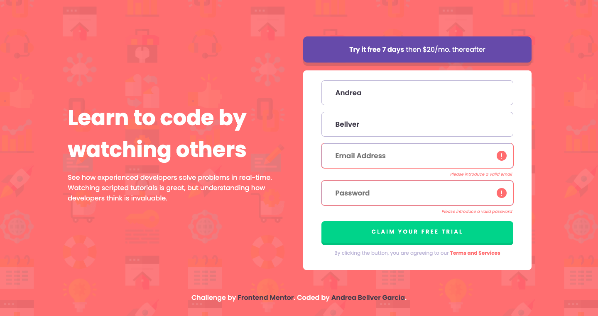

# Frontend Mentor - Intro component with sign up form solution

This is a solution to the [Intro component with sign up form challenge on Frontend Mentor](https://www.frontendmentor.io/challenges/intro-component-with-signup-form-5cf91bd49edda32581d28fd1). Frontend Mentor challenges help you improve your coding skills by building realistic projects. 

## Table of contents

- [Overview](#overview)
  - [The challenge](#the-challenge)
  - [Screenshot](#screenshot)
  - [Links](#links)
- [My process](#my-process)
  - [Built with](#built-with)
  - [What I learned](#what-i-learned)
  - [Continued development](#continued-development)
  - [Useful resources](#useful-resources)
- [Author](#author)
- [Acknowledgments](#acknowledgments)

**Note: Delete this note and update the table of contents based on what sections you keep.**

## Overview

### The challenge

Users should be able to:

- View the optimal layout for the site depending on their device's screen size
- See hover states for all interactive elements on the page
- Receive an error message when the `form` is submitted if:
  - Any `input` field is invalid. The message for this error should say *"Please introduce a valid [Type of Input]"*

### Screenshot

### Links

- Solution URL: [Repository  Solution](https://github.com/ponisworld/intro_component_with_signup)
- Live Site URL: [Live site URL](https://ponisworld.github.io/intro_component_with_signup/)

## My process

### Built with

- Semantic HTML5 markup
- CSS custom properties
- Flexbox
- Mobile-first workflow

### What I learned

I really loved this challenge! It made me think a lot, because I wanted to practice VanillaJS so bad that I made this form validation fully Vanilla, no APIs or Libraries, from scratch. Mainly, because I didn't like any kind of tutorials that I came across. I thought every tutorial was so simple and at the same time, so wack and long that I couldn't maintain my attention. I made a flowchart for doing this, as well as some testing on paper. I really had so much fun making this and I'm happy that it went so well for me. 

### Continued development

I think that I would copy just this try in every validation form I have to do on a long basis, because that will save me so much time to make a bigger webpage.

### Useful resources

- [RegExr](https://regexr.com/) - This helped me for the RegEx expression. I really liked this pattern and will use it going forward.

## Author

- Website - [LinkedIn](https://www.linkedin.com/in/andrea-bellver-garcia/)
- Frontend Mentor - [@ponisworld](https://www.frontendmentor.io/profile/ponisworld)
- Twitter - [@poniscript](https://www.twitter.com/poniscript)

## Acknowledgments

I was really scary of doing it and even with the design done for two weeks, I tried to not touch it a lot for not getting overwhelmed of it. Even though, It's very pretty and functional btw!

I recommend to anyone first write the process, each step. That would help you a lot!